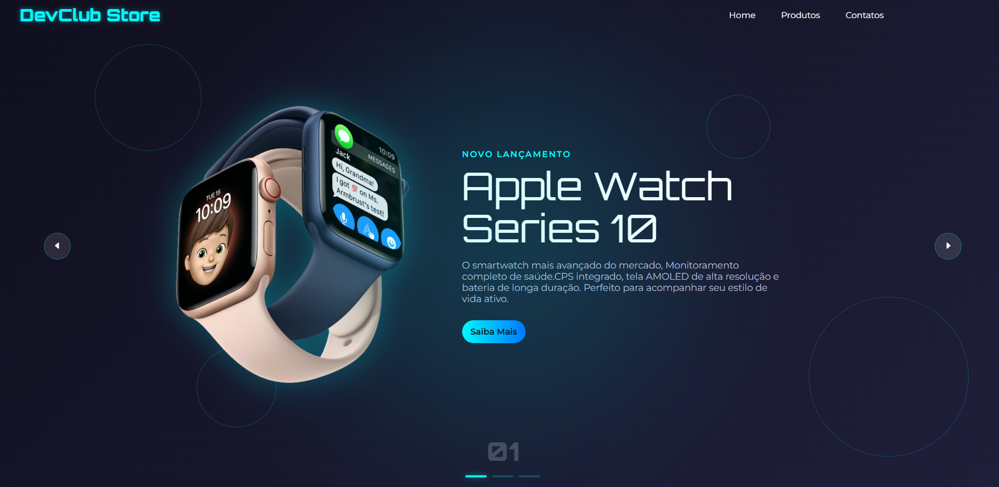

#  DevClub Store - Landing Page de Produtos Tecnológicos

Uma landing page moderna e responsiva para a **DevClub Store**, apresentando uma vitrine dinâmica de diferentes produtos tecnológicos (como o Apple Watch Series 10). Desenvolvida com HTML, CSS e JavaScript puro, o projeto destaca a alternância de produtos, design futurista e interatividade fluida.

##  Live Demo / Projeto Online
**Veja o projeto em funcionamento aqui:** [https://clubstore-dev.netlify.app/]

##  Recursos do Projeto

* **Design Minimalista e Moderno:** Tema escuro (`dark mode`) focado em destacar produtos premium.
* **Carrossel de Múltiplos Produtos:** Apresentação dinâmica que alterna entre diferentes produtos, mudando a imagem, descrição e o botão de ação.
* **Animações em Botões:** Efeitos de `hover` e transições para uma melhor experiência do usuário.
* **Navegação Simples:** Menu de navegação claro e intuitivo.
* **Tecnologias Core:** Construído exclusivamente com HTML, CSS e JavaScript.

##  Tecnologias Utilizadas

Este projeto foi construído apenas com tecnologias web padrão, o que o torna leve e eficiente.

* `HTML5`: Para a estrutura e conteúdo da página.
* `CSS3`: Para estilização, layout e as animações de transição.
* `JavaScript (Vanilla JS)`: Para o controle do carrossel que gerencia a troca dos diferentes produtos e suas informações associadas.

##  O que eu aprendi

Este projeto foi uma ótima oportunidade para aprofundar conhecimentos em:

* **Manipulação de DOM e Lógica Complexa:** Gerenciamento do carrossel para garantir que, ao trocar o produto, a descrição, o título e a imagem sejam atualizados de forma sincronizada.
* Criação de carrosséis ou *sliders* dinâmicos usando JavaScript puro.
* Aplicação de animações e transições suaves com CSS para melhorar a experiência de troca de conteúdo.

##  Contato

Se tiver alguma dúvida, sugestão ou quiser se conectar:

* **kauacomk123:**
* **LinkedIn: https://www.linkedin.com/in/kau%C3%A3-santana-589083232/**
* **Email: Kauasantana2707@gmail.com**
